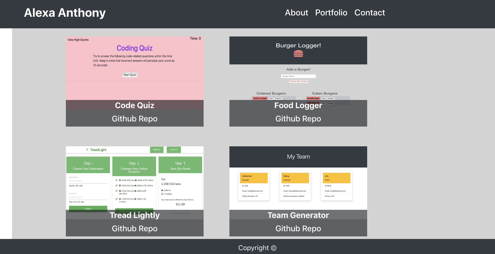

# React-based-profile

# Table of Contents (Optional)
N/A

# Installation
Github Repo: https://github.com/alexahanthony/react-profile 

Heroku Deployed Site: https://salty-shelf-04975.herokuapp.com/

# Usage
Click through the website! The About section has information about myself. The Portfolio section has images with text overlay indicating which project and that text does link to another page. The Contact page has a form to submit and there is a buttom that changes color when clicked. This application was built using react.

# Credits
There were no collaborators, (other than classmates and teacher feedback).

# License
N/A

# Badges
N/A

# Contributing
N/A

# Tests
N/A